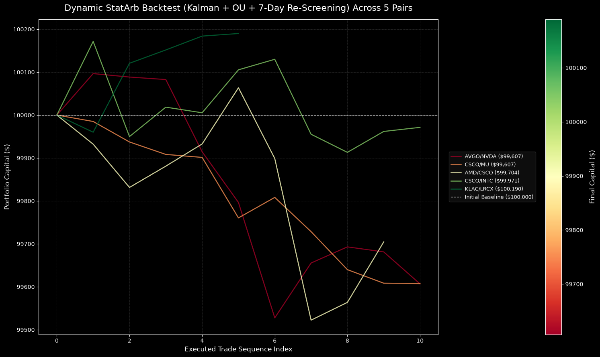
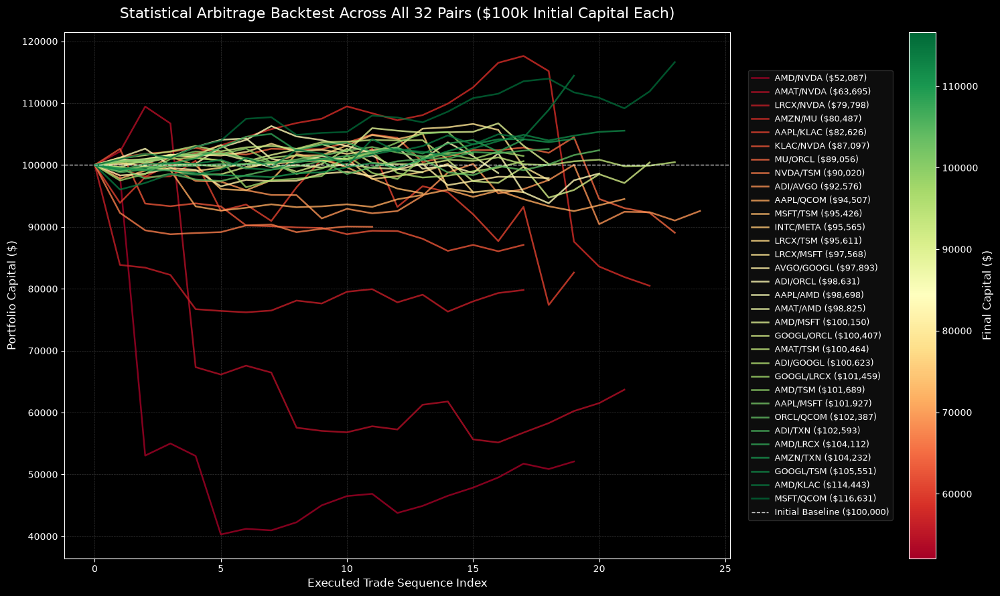
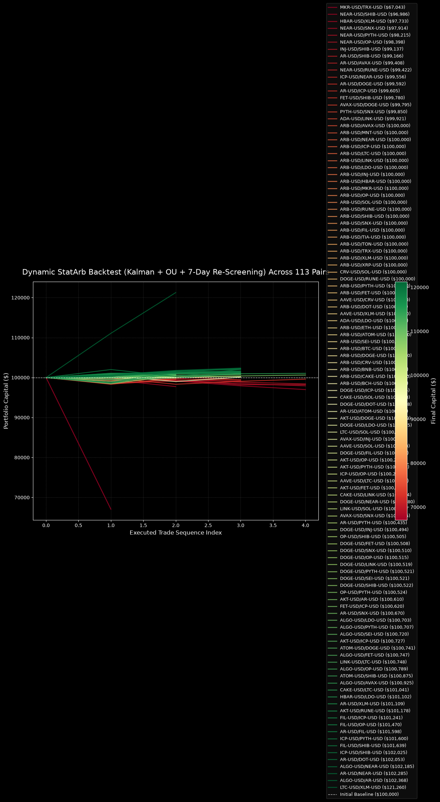
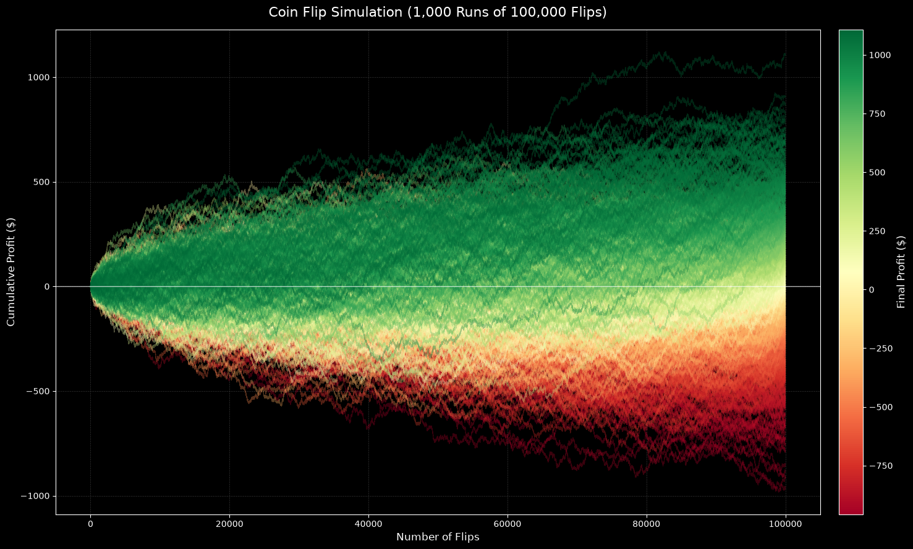
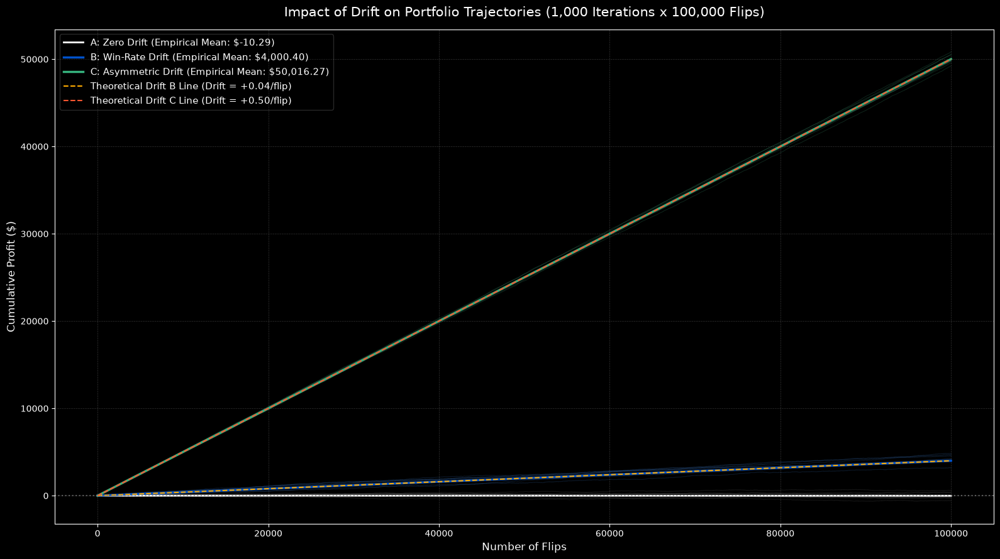

# Dynamic Statistical Arbitrage

A research project for **pairs trading**: screen asset pairs for cointegration, estimate their hedge relationship dynamically, and backtest mean-reversion entries and exits. It includes notebooks for experiments and a small browser app for running the dynamic strategy with user-selected tickers and price intervals.

> **Research only.** This is an educational backtesting project, not investment advice or a production trading system. Historical simulation results do not predict future performance.

## At a glance

- **Universe:** user-selected Yahoo Finance symbols; the app accepts 2–40 unique tickers.
- **Pair screening:** Engle–Granger cointegration test on the chronological training portion, with a 5% p-value threshold.
- **Dynamic hedge:** a Kalman filter updates the intercept and hedge ratio over time.
- **Signals:** a rolling spread z-score; default entry threshold 2, exit at 0, and stop at 3.5.
- **Risk circuit breaker:** pairs are re-screened during the backtest; a failed cointegration check closes an open position.
- **Outputs:** a pair statistics table, completed-trade-count chart, realized equity-curve chart, and CSV summary.
- **Intervals in the app:** daily, hourly, 30-minute, and 15-minute. Yahoo Finance limits the lookback available for intraday intervals.

## Run the web app

The app uses the Python dependencies in [`app/requirements.txt`](app/requirements.txt) and serves its own HTML UI.

```bash
python -m venv venv
source venv/bin/activate
python -m pip install -r app/requirements.txt
python app/server.py
```

On Windows PowerShell, activate the environment with `venv\Scripts\Activate.ps1`. Then open <http://127.0.0.1:8000>.

Enter two or more Yahoo Finance symbols separated by commas, spaces, or newlines. Choose a start date and interval, initial capital, and z-score thresholds. If no training pair passes the 5% screening level, the app tests up to the 10 pairs with the lowest available p-values.

The app writes `dynamic_statistical_arbitrage_summary.csv` in the project root and provides a download link after a successful run. A later run replaces that file. You need internet access for Yahoo Finance price data.

### Deploy to Render

Create a **Web Service** in Render connected to this repository, with the repository root as the service root directory. Use:

| Render setting | Value |
| --- | --- |
| Build command | `pip install -r app/requirements.txt` |
| Start command | `python app/server.py` |

The server binds to `0.0.0.0` when Render sets its `RENDER` environment variable and listens on the port from `PORT`. Locally, it keeps the `127.0.0.1:8000` default. If Render reports no open port, confirm the service is a **Web Service**, the start command runs `app/server.py`, and the app starts successfully and listens on the provided port.

The CSV is written to local disk; hosted filesystems may not persist between restarts or deployments. Use persistent storage or a separate object store if exported summaries must be retained. This development server does not include production hardening such as authentication, request rate limiting, or background jobs.

## Strategy walkthrough

### 1. Select pairs by cointegration

Correlation describes how two series move together over a sample; cointegration asks whether a linear combination of non-stationary price series behaves like a stationary spread. The app evaluates each ticker pair on the first 80% of observations, ordered in time:

\[
P_{1,t} = \alpha + \beta P_{2,t} + \epsilon_t
\]

The Engle–Granger test evaluates the residual relationship. A p-value below 0.05 qualifies a pair for the backtest. If none qualifies, the lowest-p-value pairs are used as a fallback; this fallback is a way to produce research candidates, **not** evidence that those pairs are cointegrated.

### 2. Update hedge parameters with a Kalman filter

Rather than holding the regression intercept and hedge ratio fixed, the strategy treats them as evolving state variables:

\[
\boldsymbol{\theta}_t =
\begin{bmatrix}\alpha_t\\\beta_t\end{bmatrix},\qquad
P_{1,t} =
\begin{bmatrix}1 & P_{2,t}\end{bmatrix}\boldsymbol{\theta}_t + v_t
\]

The filter predicts the state and its uncertainty, compares its predicted price with the observed price, and uses the resulting innovation and Kalman gain to update \(\alpha_t\) and \(\beta_t\). The dynamic residual spread used for signals is:

\[
S_t = P_{1,t} - (\alpha_t + \beta_t P_{2,t})
\]

This can adapt to changing relationships, but adaptation alone does not guarantee a stable or tradable hedge.

### 3. Estimate mean reversion and standardize the spread

The report describes spread behavior with an Ornstein–Uhlenbeck (OU) process:

\[
dS_t = \kappa(\mu-S_t)\,dt + \sigma\,dW_t
\]

Here, \(\mu\) is the equilibrium level, \(\kappa\) is the mean-reversion rate, and \(\sigma\) is spread volatility. In the implementation, an AR(1) regression is fitted to the recent spread:

\[
S_t = a + \phi S_{t-1} + e_t,\qquad
\text{half-life} = \frac{\ln 2}{-\ln \phi}
\quad (0 < \phi < 1)
\]

The app computes the signal z-score from a rolling window of 60 spread observations. The half-life is estimated from recent observations too; it is informational and is **not** currently used as an extra pair-selection or trade-entry filter. The code returns an unavailable half-life when the fitted process does not meet the mean-reversion condition.

### 4. Enter, exit, and re-screen

With the default thresholds:

| Signal | Condition | Action |
| --- | --- | --- |
| Long spread | \(z_t \leq -2.0\) | Long asset 1 and hedge with asset 2 |
| Short spread | \(z_t \geq +2.0\) | Short asset 1 and hedge with asset 2 |
| Take profit | Spread z-score crosses back through 0 | Close both legs |
| Stop / circuit breaker | \(|z_t| \geq 3.5\), or a scheduled cointegration check fails | Close both legs |

The hedge quantities are calculated using the current prices and Kalman beta. The current implementation allocates 15% of current pair capital across the two legs, with the second leg scaled by beta. Short selling, borrow, and order execution are simulated only through the simplified price-difference P&L calculation; no actual broker orders are placed.

## Charts and saved research figures

The app renders two charts for each run:

1. **Completed trades by pair** compares the number of closed trades.
2. **Equity curves by pair** plots capital after each closed trade. It includes the initial-capital baseline and uses a red-to-green scale for final capital.

The charts below are saved notebook/report figures, not results generated by opening this README. They illustrate the experiments in the repository; the app recomputes results from the selected symbols, dates, and interval.

### Dynamic Kalman + OU: technology pairs



### Static pairs trading comparison



### Dynamic Kalman + OU: crypto pairs

The crypto run screens a much larger set of combinations. Many lines and legend entries make the saved all-pairs chart crowded; use the app's table and per-pair details when interpreting individual results.

<details>
<summary>Show saved crypto equity-curve chart</summary>



</details>

### Coin-flip and drift simulations

These figures belong to a separate probability simulation notebook and are not results of the pairs-trading strategy.

<details>
<summary>Show coin-flip and drift experiment figures</summary>





</details>

## How to read the statistics

| Statistic | Meaning | Important qualification |
| --- | --- | --- |
| **Final beta (Kalman)** | Last estimated hedge ratio for the pair. | It is a model estimate, not a promise of a fixed or optimal hedge. |
| **OU half-life (bars)** | Estimated number of observations for the spread's deviation to halve under the fitted OU/AR(1) model. | Its unit is bars, not always days; compare only like intervals. It can be unavailable when the recent spread does not fit the mean-reverting model. |
| **Initial / final capital** | Starting capital and capital after realized, closed-trade P&L. | Open positions at the end are not force-closed or marked to market. |
| **Net profit / return** | Final minus initial capital; net profit divided by initial capital. | No commissions, slippage, financing, borrow, or market-impact costs are deducted. |
| **Total trades** | Number of completed round trips in the test segment. | An entry still open at the end is not counted as a completed trade. |
| **Win rate** | Profitable closed trades divided by all closed trades. | Does not describe the size of wins versus losses or the uncertainty from a small trade sample. |
| **Maximum drawdown** | Largest peak-to-trough decline in the recorded equity sequence. | The current engine records equity when trades close, so this is realized trade-sequence drawdown, not intratrade mark-to-market drawdown. |

The equity graph follows the same closed-trade sequence as the strategy's recorded equity curve. It should not be read as a daily mark-to-market portfolio chart. When comparing pairs with different trade counts, the x-axis is the executed trade sequence index—not a common calendar-time axis.

## What the accompanying PDF reports

[`Stat_Arb_Pairs_Trading_Strategy.pdf`](Stat_Arb_Pairs_Trading_Strategy.pdf) is a six-page methodology and execution note. It covers Engle–Granger screening, dynamic Kalman estimates, OU mean reversion, z-score execution rules, a static-versus-dynamic performance table, a Python example, and an operational checklist.

The report describes screening roughly 190 combinations down to about 32 candidate pairs. That count is specific to the report's example universe; the app creates every pairwise combination from its selected tickers (up to 780 combinations at the 40-ticker limit). Its operational checklist also recommends confirming short-selling mechanics with a broker and paper trading for 10 consecutive sessions before considering live execution. The app itself does not connect to a broker or place orders.

Its historical comparison table reports:

| Reported measure | Static OLS | Dynamic Kalman + OU |
| --- | ---: | ---: |
| Mean half-life | 101.1 days | 0.23 days |
| Average universe return | -4.79% | +0.15% |
| Worst drawdown | -59.70% (AMD/NVDA) | -4.71% (AAPL/KLAC) |
| Highest reported win rate | 69.57% (MSFT/QCOM; +16.63% return) | 88.89% (MU/ORCL; +1.71% return) |

These numbers are **as reported by the PDF**, not a fresh or independently reproduced benchmark. They describe that report's datasets and assumptions; they should not be treated as a guarantee, a live result, or directly comparable to a new app run without matching the universe, dates, sampling interval, split, costs, and accounting method. The PDF's 0.23-day dynamic half-life is from its own daily experiment; the app reports half-life in bars to accommodate intraday data as well.

The PDF also gives an "optimal" half-life range of 5–30 bars. Treat that as a research suggestion, not a validated rule: the reported average of 0.23 days is expressed in a different unit, and the current app does not filter pairs by half-life. The app's supported intervals are daily, hourly, 30-minute, and 15-minute; the PDF additionally mentions 4-hour bars, which the current app does not offer.

## Research limitations

- No commissions, bid/ask spread, slippage, borrow availability/cost, funding, taxes, or execution delay.
- No forced liquidation or mark-to-market of open positions at the end of the test period.
- Drawdown is based on the recorded closed-trade equity sequence, so it can understate risk while a trade is open.
- Cointegration and parameter estimates are sample-dependent. Screening many combinations creates multiple-testing and selection risks; pairs can stop being cointegrated.
- The app uses an 80/20 chronological split and downloads adjusted prices from Yahoo Finance. Data quality, history availability, symbols, and intraday limits depend on that external provider.
- The daily and intraday strategies operate on bar counts. A 60-bar signal window, 7-bar re-screen cadence, and OU half-life therefore represent different amounts of clock time at different intervals.
- This is not a production trading service; use paper trading, independent validation, realistic execution/cost assumptions, and risk review before considering any real-world use.

## Repository map

| Path | Purpose |
| --- | --- |
| [`app/`](app/) | Local web interface, Python backtest endpoint, CSV export, and focused tests. |
| [`app/README.md`](app/README.md) | App-specific setup notes. |
| [`Stat_Arb_Pairs_Trading_Strategy.pdf`](Stat_Arb_Pairs_Trading_Strategy.pdf) | Strategy theory, implementation example, and historical comparison. |
| [`dynamic-multi-ticker-stats-arbitrage-sim.ipynb`](dynamic-multi-ticker-stats-arbitrage-sim.ipynb) | Dynamic multi-ticker Kalman/OU strategy notebook. |
| [`multi-ticker-stats-arbitrage-sim.ipynb`](multi-ticker-stats-arbitrage-sim.ipynb) | Multi-ticker screening and backtest experiment. |
| [`statistical-arbitrage-sim.ipynb`](statistical-arbitrage-sim.ipynb) | Static statistical-arbitrage experiment. |
| [`pairs_trading_ko_pep_optimised.ipynb`](pairs_trading_ko_pep_optimised.ipynb) | Optimized KO/PEP pairs-trading experiment. |
| [`symmary-analysis.ipynb`](symmary-analysis.ipynb) | Summary/analysis notebook. |
| [`coin-flip.ipynb`](coin-flip.ipynb) | Separate coin-flip and drift simulation. |
| `*_summary*.csv` | Saved outputs from earlier notebook runs; columns and methodology can differ between experiments and the current app. |
| [`images/`](images/) | Saved plots from notebook experiments. |

## Run the focused app tests

```bash
python -m unittest discover -s app -p 'test_*.py' -v
```
